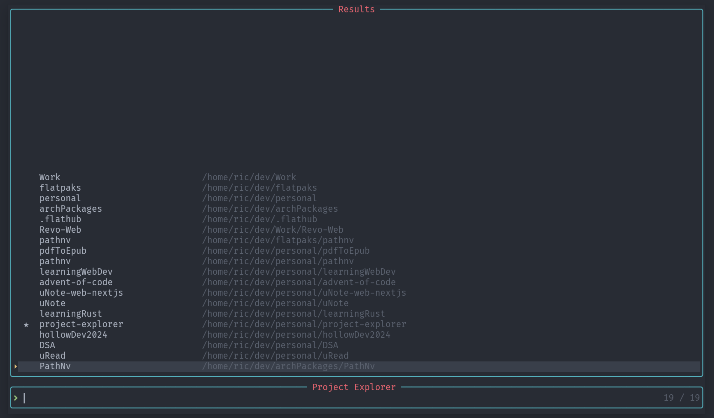

# Project Explorer for neovim

Simple project manager and explorer for neovim



## Features

- List Projects based of pattern
- Create new projects directory
- Add projects to favorites
- List favorites projects only

## Installation

- Lazy.nvim

```lua
return {
  "Rics-Dev/project-explorer.nvim",
  dependencies = {
    "nvim-telescope/telescope.nvim",
  },
  opts = {
    paths = { "~/dev/*" }, --custom path set by user
    newProjectPath = "~/dev/", --custom path for new projects
    file_explorer = function(dir) --custom file explorer set by user
      vim.cmd("Neotree close")
      vim.cmd("Neotree " .. dir)
    end,
    -- Or for oil.nvim:
    -- file_explorer = function(dir)
    --   require("oil").open(dir)
    -- end,
  },
  config = function(_, opts)
    require("project_explorer").setup(opts)
  end,
  keys = {
    { "<leader>fp", "<cmd>ProjectExplorer<cr>", desc = "Project Explorer" },
  },
  lazy = false,
}
```

## How to use

Default keybinding is `<leader>fp` to open the project explorer
you can also open it by executing `:ProjectExplorer`

- To cd into a project just press `Enter` on the selected project.
- To Add a project use `<C-a>`.
- To add a project to favorite projects use `<C-A-f>`
- To display favorite projects only use `<C-f>`.
